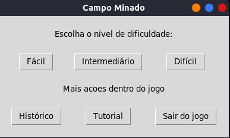

<h1 align="center"> Campo minado </h1>

:construction: Projeto em construção :construction:

[Descrição do Projeto](#Trabalho desenvolvido para a disciplina de Tópicos especiais II - abaixo as imagens do jogo em execução)

# :hammer: Funcionalidades do projeto

- `Funcionalidade 1`: descrição da funcionalidade 1
- `Funcionalidade 2`: descrição da funcionalidade 2
- `Funcionalidade 2a`: descrição da funcionalidade 2a relacionada à funcionalidade 2
- `Funcionalidade 3`: descrição da funcionalidade 