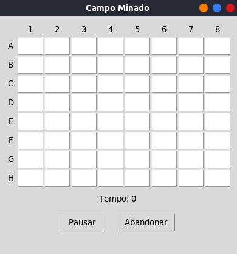
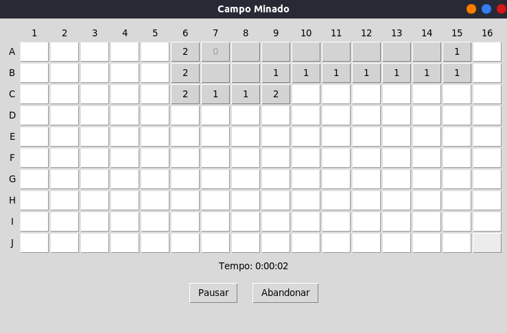
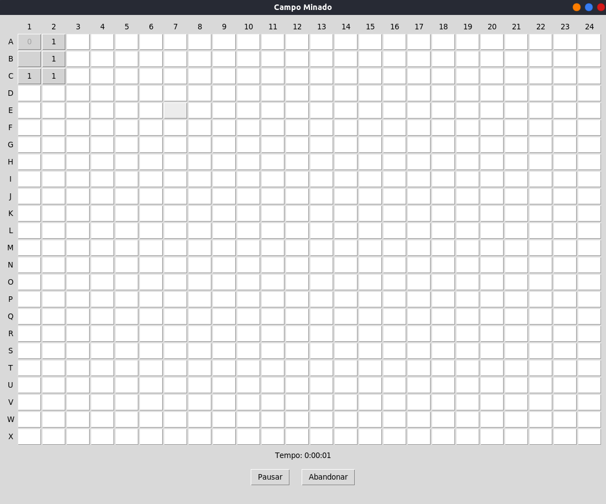

<h1 align="center"> Campo minado </h1>

### Tópicos 

- [Apresentando o jogo](#descrição-do-projeto)

- [Como Jogar?](#como-jogar)

- [Aplicação](#aplicação)

- [Ferramentas utilizadas](#ferramentas-utilizadas)

- [Acesso ao projeto](#acesso-ao-projeto)

- [Abrir e rodar o projeto](#abrir-e-rodar-o-projeto)

- [Desenvolvedores](#desenvolvedores)

## Apresentado o jogo

O projeto foi desenvolvido como um trabalho avaliativo da disciplina de Tópicos Especiais II (COnteúdo da disciplina - Testes de Software)

### Tela de menu

## Jogo fácil

## Jogo intermediário

## Jogo Difícil

# :hammer: Como jogar?

- `Funcionalidade 1`: O botão esquerdo do mouse serve para revelar células
- `Funcionalidade 2`: O botão direito do mouse serve para adicionar e remover bandeiras
- `Funcionalidade 3`: Antes de iniciar a partida, as informações de nível, número de bombas e bandeiras é apresentada
- `Funcionalidade 4`: Após acabar a partida, retorne ao menu para jogar novamente
