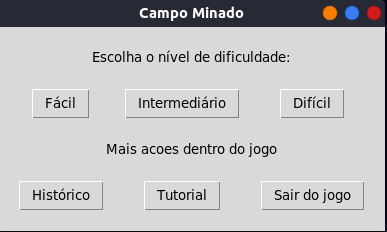
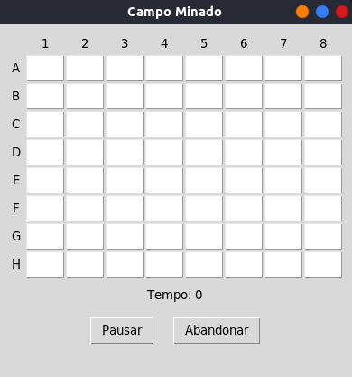
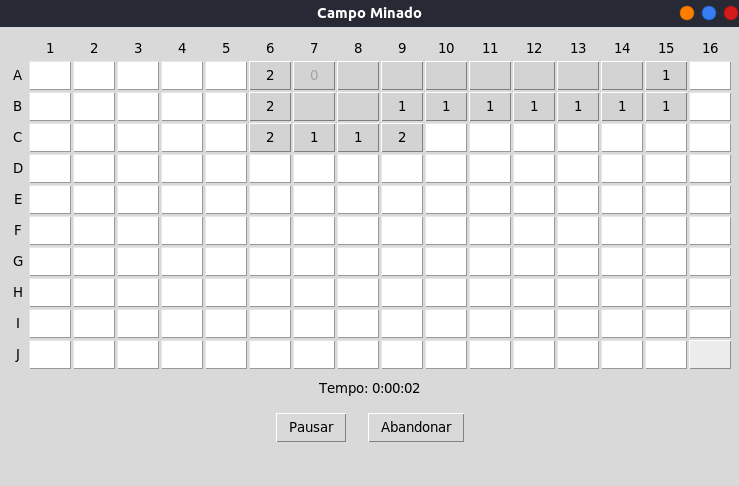
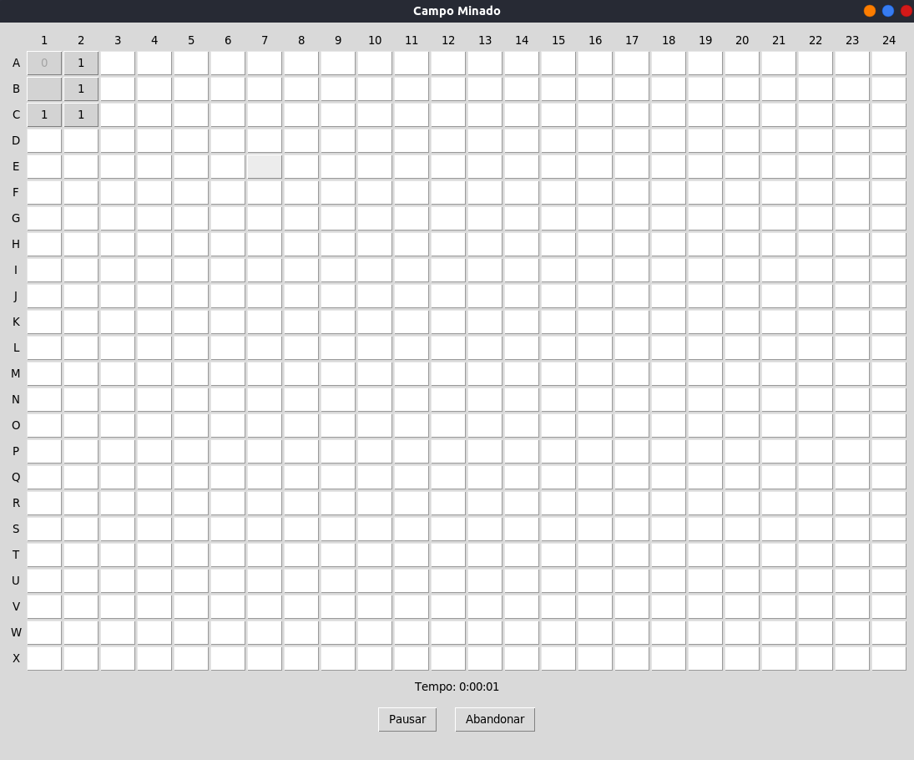
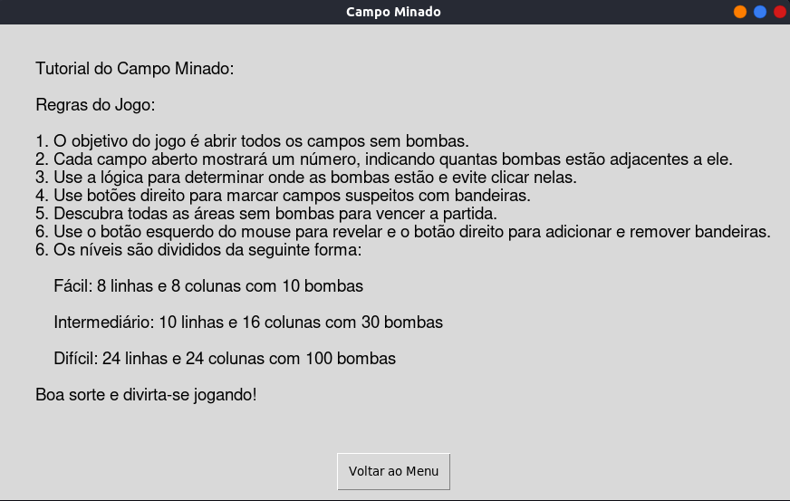

<h1 align="center"> Campo minado </h1>

### Tópicos 

- [Apresentando o jogo](#apresentando-o-jogo)

- [Como eu consigo Jogar?](#como-jogar)

- [Como rodar o projeto?](#como-rodar-o-projeto)

- [Como consigo executar  os testes?](#como-executar-os-testes)

- [Requisitos e casos de testes](./requisitos)

## Apresentando o jogo

<p align="justify">
O projeto foi desenvolvido como um trabalho avaliativo da disciplina de Tópicos Especiais II (COnteúdo da disciplina - Testes de Software)

### Tela de menu



### Jogo fácil


### Jogo intermediário


### Jogo Difícil


### Tutorial


</p>

## :hammer: Como Jogar

- `Funcionalidade 1`: O botão esquerdo do mouse serve para revelar células
- `Funcionalidade 2`: O botão direito do mouse serve para adicionar e remover bandeiras
- `Funcionalidade 3`: Antes de iniciar a partida, as informações de nível, número de bombas e bandeiras é apresentada
- `Funcionalidade 4`: Após acabar a partida, retorne ao menu para jogar novamente

## Como rodar o Projeto?

### Clone o repositório

```sh
git clone https://github.com/crishard/campo_minado.git
```

### Entre na raiz do projeto 

```sh
cd campo-minado
```

### Instale todas as dependências

```sh
pip3 install -r requirements.txt
```

### Execute o jogo já compilado

```sh
python3 campo_minado.py
```

## Como executar os testes?

### Dentro do diretório do projeto (caminho/campo-minado) execute

```sh
python3 -m pytest ./tests
```
